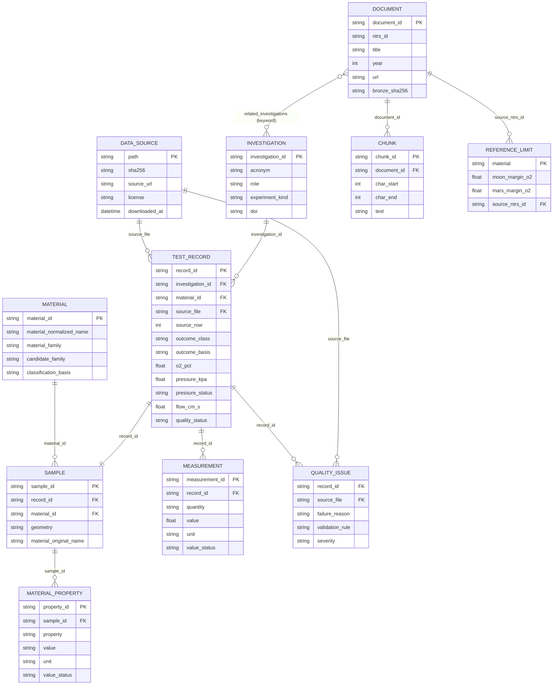

# ER Diagram

```mermaid
erDiagram
    DATA_SOURCE ||--o{ TEST_RECORD : "source_file"
    INVESTIGATION ||--o{ TEST_RECORD : "investigation_id"
    MATERIAL ||--o{ SAMPLE : "material_id"
    TEST_RECORD ||--|| SAMPLE : "record_id"
    SAMPLE ||--o{ MATERIAL_PROPERTY : "sample_id"
    TEST_RECORD ||--o{ MEASUREMENT : "record_id"
    TEST_RECORD ||--o{ QUALITY_ISSUE : "record_id"
    DATA_SOURCE ||--o{ QUALITY_ISSUE : "source_file"
    DOCUMENT ||--o{ CHUNK : "document_id"
    DOCUMENT }o--o{ INVESTIGATION : "related_investigations (keyword)"
    DOCUMENT ||--o{ REFERENCE_LIMIT : "source_ntrs_id"

    DATA_SOURCE { string path PK  string sha256  string source_url  string license  datetime downloaded_at }
    INVESTIGATION { string investigation_id PK  string acronym  string role  string experiment_kind  string doi }
    TEST_RECORD { string record_id PK  string investigation_id FK  string material_id FK  string source_file FK  int source_row  string outcome_class  string outcome_basis  float o2_pct  float pressure_kpa  string pressure_status  float flow_cm_s  string quality_status }
    MATERIAL { string material_id PK  string material_normalized_name  string material_family  string candidate_family  string classification_basis }
    SAMPLE { string sample_id PK  string record_id FK  string material_id FK  string geometry  string material_original_name }
    MATERIAL_PROPERTY { string property_id PK  string sample_id FK  string property  string value  string unit  string value_status }
    MEASUREMENT { string measurement_id PK  string record_id FK  string quantity  float value  string unit  string value_status }
    QUALITY_ISSUE { string record_id FK  string source_file FK  string failure_reason  string validation_rule  string severity }
    DOCUMENT { string document_id PK  string ntrs_id  string title  int year  string url  string bronze_sha256 }
    CHUNK { string chunk_id PK  string document_id FK  int char_start  int char_end  string text }
    REFERENCE_LIMIT { string material PK  float moon_margin_o2  float mars_margin_o2  string source_ntrs_id FK }
```

`TEST_RECORD` is a logical entity: physically it is one Silver table per investigation (`silver/investigations/*.csv`), each with its own extra columns.
